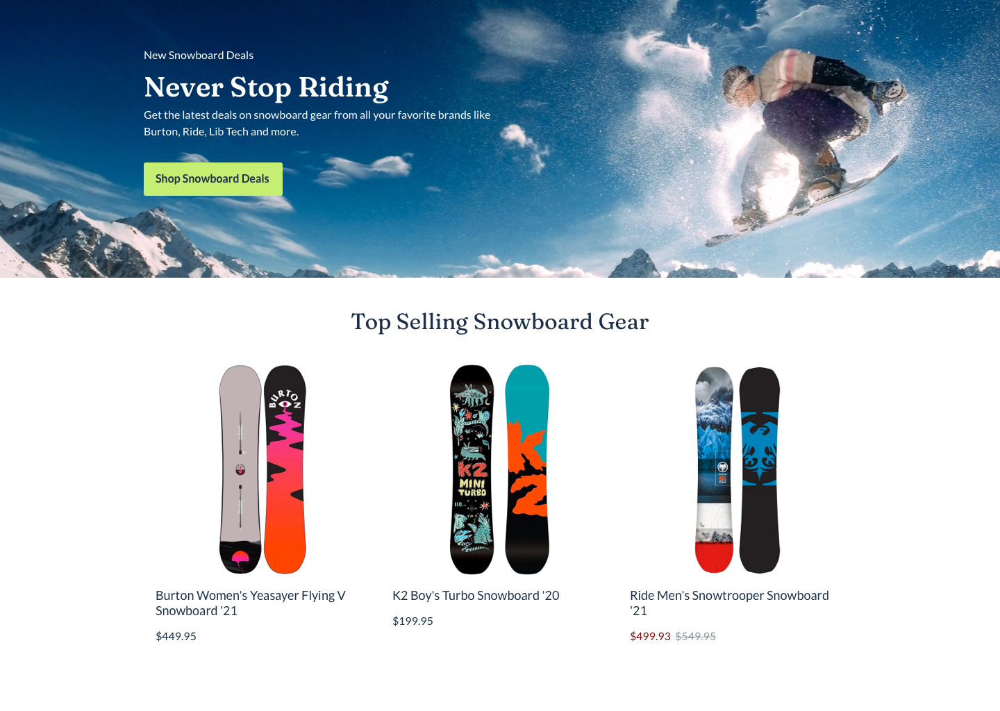

# Dev Assessment



## Overview

Without the use of a library or framework, build out the sample category page and make it as close as you can to the original design. See below for specific requirements.

## Required Functionality

- The user should see hover states on interactive elements.
- The page should scale based on screen size.
- When clicking on a product, a message is displayed if the brand is restricted (Function 1).
- When the "Shop Snowboard Deals" button is clicked in the hero banner, log the item that is on sale and the percent savings (Function 2).

## Functions

### Function 1 - Show Restricted Brands

Write a function that checks the product name for a restricted brand when the product is clicked. If the brand is restricted, display a message alerting the user of the restriction. The product name always starts with the brand name.

#### Restricted Brands

- Burton
- Patagonia
- Ride
- Thule
- Yeti

### Function 2 - Check for Sale Items

Write a function that checks for a sale item when the button in the hero banner is clicked. Use the object below and log out the product name and the percent savings (rounded to the nearest integer) in the console.

**Products Object:**

```json
{
    "products": [
        {
            "name": "Obermeyer Women's Tuscany II Jacket",
            "price": {
                "price": 259
            }
        },
        {
            "name": "The North Face Men's Arrowood Triclimate Jacket",
            "price": {
                "price": 199,
                "salePrice": 119.93
            }
        },
        {
            "name": "Patagonia Boy's Down Sweater Jacket",
            "price": {
                "price": 119
            }
        }
    ]
}
```

### Browser Support

The page should work in the following browsers:

- IE 11
- Edge
- Chrome
- Safari
- Firefox

## Resources

For this assessment, you will build out the designs located in the `ui` folder. There is a desktop and mobile version.

All image assets are located in the `images` folder.

All style information, such as typography and color scheme are located in the `STYLES.md` file.

## Deploying your project

When you have completed the project, push to your personal GitHub repo and email back the link along with the questionnaire.
